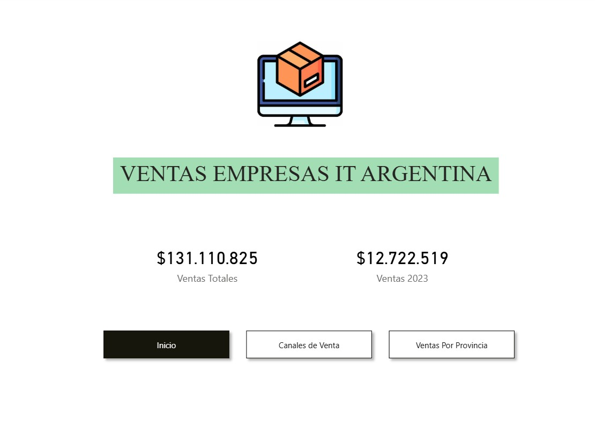
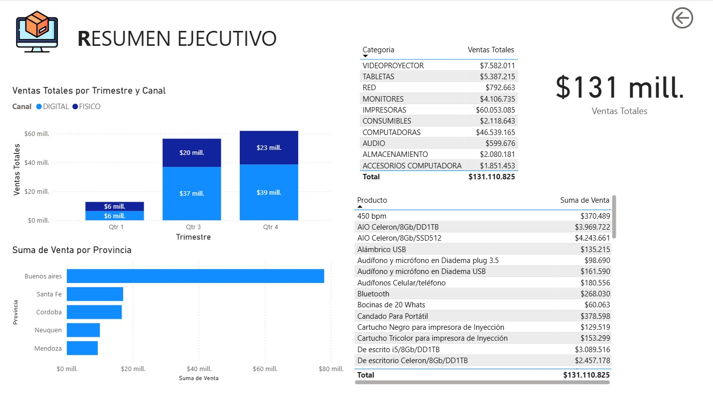
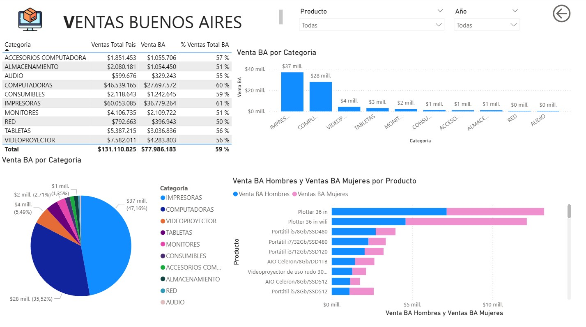

# Análisis de Ventas Integrador - Sector Retail

## 📝 Descripción del Proyecto
Este proyecto fue desarrollado como trabajo final para la certificación de **Power BI en UTN**. Consiste en la creación de un ecosistema de datos completo para una empresa de retail, integrando información de ventas, geografía, categorías de productos y perfiles de clientes.

## 🎯 Objetivos de Proyecto
- Centralizar datos provenientes de distintos formatos (Excel y TXT).
- Analizar el rendimiento de ventas por categoría y subcategoría.
- Identificar la distribución geográfica de los ingresos (Segmentación por Provincia/Ciudad).
- Evaluar el comportamiento de compra según el género y tipo de cliente.

## 🛠️ Procesos Técnicos Realizados
1. **ETL (Power Query):** - Limpieza y normalización de datos.
   - Transformación de tipos de datos y manejo de valores nulos.
   - Combinación de tablas de ventas con maestros de productos y geografía.
2. **Modelado de Datos:**
   - Creación de un modelo en estrella (Star Schema).
   - Establecimiento de relaciones uno a muchos entre dimensiones y tablas de hechos.
3. **DAX & Visualización:**
   - Creación de medidas para cálculos de Ventas Totales y porcentajes de participación.
   - Implementación de visualizaciones dinámicas: Mapas, Gráficos de Treemap para categorías y análisis de barras comparativas.

## 📈 Resultados Clave
- **Visibilidad Geográfica:** Identificación de Buenos Aires como el principal foco de ingresos (59% del total).
- **Rendimiento de Producto:** Las categorías de Impresoras y Computadoras representan el mayor volumen de facturación.
- **Insights de Cliente:** Análisis detallado de la paridad de compras entre géneros dentro de las categorías principales.

---
## 🖼️ Vista Previa del Dashboard

## 📥 Cómo visualizarlo
1. Descarga el archivo `.pbix` de este repositorio.
2. Ábrelo con **Power BI Desktop**.
